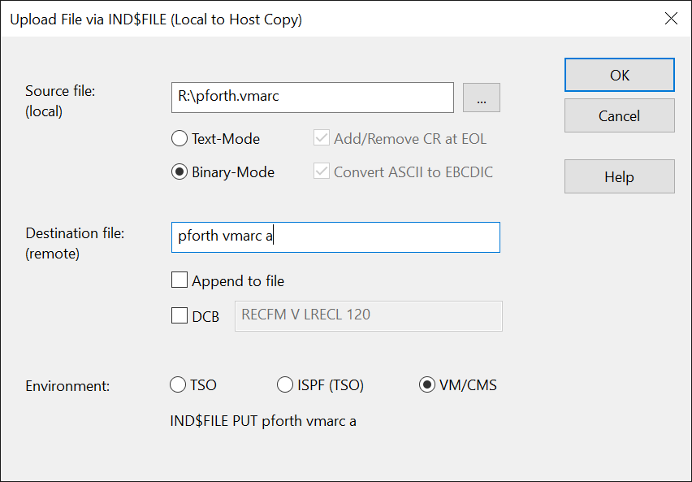
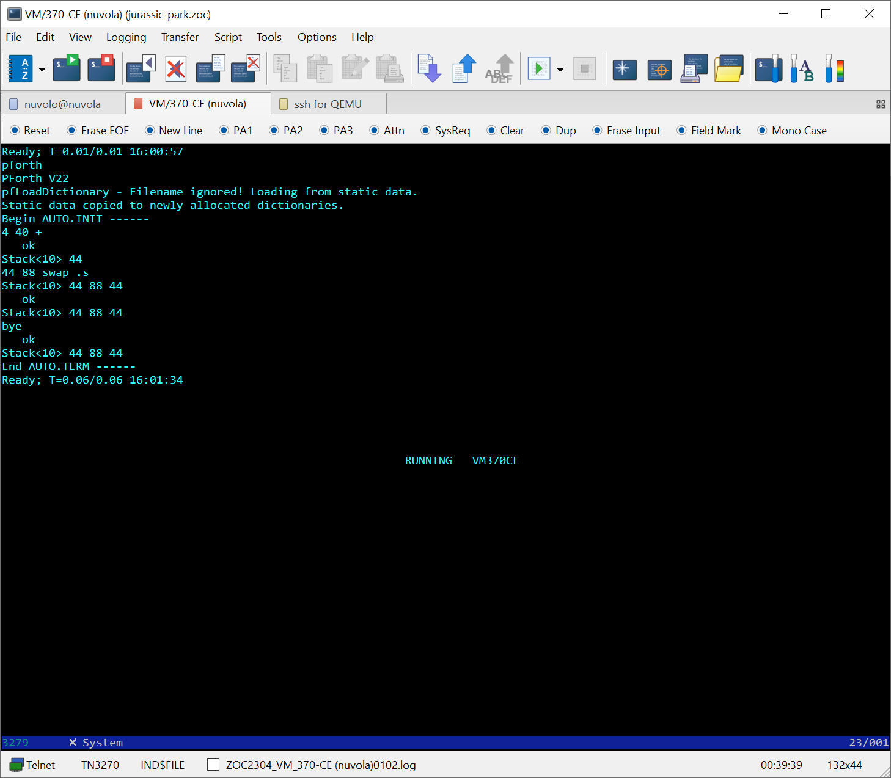
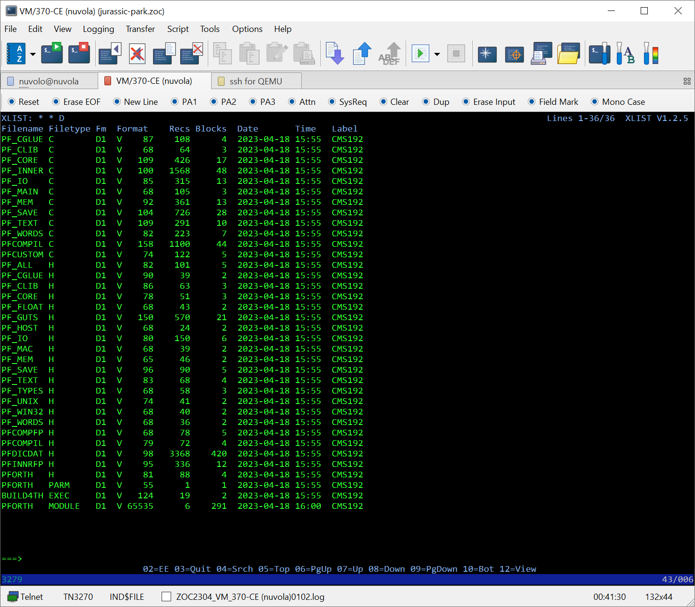

# PFORTH-CMS - Portable ANS-like Forth for VM/370

Last updated: 18.04.2023

This implementation of pForth derives from an earlier implementation for MVS-3.8j made in 2007 which is described [here](https://www.complang.tuwien.ac.at/anton/forth-tagung07/vortraege/pforth.pdf).
Recently I rediscovered the sources and adapted the port to VM/370's GCCCMS compiler.

## How to Build PFORTH-CMS

You need a Big-Endian platform to build PFORTH-CMS.

On Linux (s390x or powerpc):

    cd csrc
    ./build4th.sh

This should build pforth in the current directory that you can run with

    ./pforth
    
On VM/370:

You can copy ./csrc/pforth.vmarc to VM/370 using IND$FILE

I use the disk D as a scratch development disk so I do as follow.
    
    ERASE * * D1
    VMARC UNPACK PFORTH VMARC A * * D
    BUILD4th
    
If the build is successful you shoud have
    
    PFORTH MODULE D
    
that you can run with
    
    PFORTH

------

### Images

PFORTH-CMS running inside VM/370 Community Edition.

xlist of the CMS disk with the source code and the compiled PFORTH.MODULE

------

### License
PFORTH-CMS is made available under the terms of the [GPLv3][gplv3].

See the [LICENSE][license] file that accompanies this distribution for the full text of the license.

[gplv3]: http://www.gnu.org/licenses/gpl.html
[license]: ./LICENSE
